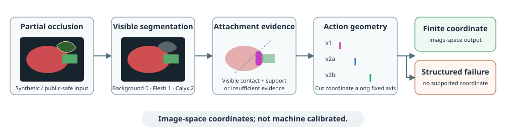
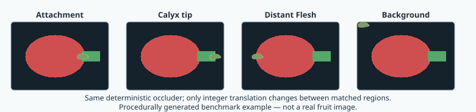

# Occlusion-Aware Strawberry Perception for Robotic Cut Estimation

An independent Python/PyTorch research pipeline for studying how partial
occlusion propagates from visible semantic segmentation into image-space robotic
cut-coordinate estimates and failure behavior.

> **Central research question:** How does partial visual occlusion propagate
> from semantic segmentation into downstream robotic cut-coordinate estimation,
> and how should a vision-guided system recognize when available evidence is
> insufficient to support an action?

## Research progression

| Stage | Research question | Status |
|---|---|---|
| Segmentation | Can visible Flesh and Calyx be segmented reproducibly? | Complete |
| v1 → v2a → v2b | How should segmentation be converted into an interpretable cut coordinate? | Complete |
| M4 | Do controlled attachment-region perturbations disproportionately destabilize the downstream cut coordinate relative to background perturbations? | Complete |
| M5-v0 | Can signals available from the current observation identify downstream action instability? | Complete; exploratory |
| M5-v1 | Does a frozen selective-action rule improve retained action stability? | Complete; improvement not demonstrated; development reuse |
| Next | How should the system choose among act, withhold, or acquire additional information on new fruit groups? | Planned; not yet specified |



## What this is—and what it is not

The functioning physical prototype uses a separate **HIKROBOT
VisionMaster/VisionTrain** machine-vision system. The Python/PyTorch pipeline in
this repository is independent research code: its ResNet34 model and v1/v2a/v2b
estimators are not currently controlling the physical machine.

The tracked repository contains no PLC control code, machine calibration,
deployment configuration, or production thresholds. It should not be read as a
release of the deployed industrial system or as evidence of physically
calibrated cutting performance.

## Approach

1. **Visible semantic segmentation** predicts `Background = 0`, `Flesh = 1`,
   and `Calyx = 2` with a ResNet34-encoder U-Net baseline.
2. **Attachment evidence** is derived from visible Flesh/Calyx component contact
   and diagnostic support regions.
3. **Action geometry** converts that evidence into an image-space coordinate:
   v1 uses visible-shape geometry, v2a uses a fixed axis and robust contact
   projection, and v2b searches for the outermost evidence-supported candidate.
4. **Failure-aware evaluation** keeps structured no-coordinate outcomes separate
   from silent drift, where a finite coordinate is returned but changes under
   occlusion.

The central unit of evaluation is therefore not segmentation quality alone, but
the chain from visual evidence to a downstream action proxy. See
[cut-coordinate methods](docs/cutline_methods.md) for definitions and coordinate
conventions.

## Controlled matched-occlusion benchmark

The implemented `m4_v1` profile generates one deterministic opaque occluder for
each sample, severity, and seed, then translates that exact template between
four matched regions:

- attachment;
- calyx tip;
- distant Flesh;
- background.



This figure is generated by the same procedural matched-placement code used by
the repository benchmark.

The frozen severities are 0.01, 0.02, and 0.04 of clean visible foreground area;
the frozen seeds are 0 and 1. Attachment versus background is the primary
comparison, and `group_id` / fruit group is the independent analysis unit.
Placement failures and incomplete severity coverage are recorded rather than
imputed.

The benchmark uses **severity-integrated attachment − background stability
difference** for its primary summary. Internal `*_auc` fields are normalized
trapezoidal integrations over the three severities after rescaling severity to
`[0,1]`; they are not ROC AUC. Full design, conditioning, and denominator details
are in the [M4 benchmark documentation](docs/m4_occlusion_benchmark.md).

## Status and evidence boundary

Implemented and tracked:

- three-class training, inference, evaluation, uncertainty diagnostics, and
  headless visualization;
- deterministic v1, v2a, and v2b mask-to-coordinate geometry with structured
  failure codes;
- training-mask v2b sensitivity analysis, followed by a frozen reference
  configuration used unchanged by later benchmark code;
- a preliminary new-batch evaluation workflow, configured by default for seven
  images, with automated sample-ID and image-content-hash overlap auditing;
- controlled four-region synthetic occlusion for evaluation and group-aware
  failure/stability summaries;
- preliminary M5-v0 current-observation probability and frozen-geometry support
  signals, with group-level rank association to action instability;
- frozen M5-v1 group-first risk associations and global-threshold
  selective-action curves with group bootstrap, a descriptive
  random-withholding reference, and an explicit development-reuse claim
  boundary. The development-reuse analysis is complete and frozen: the
  pre-specified
  70%-requested geometry policy did not demonstrate improved retained action
  stability (`Delta_70 = -0.582 px`; 95% group-cluster-bootstrap interval
  [-1.090, 0.788]).

The approved M5-v1 aggregate result is documented as descriptive,
selection-biased, and non-confirmatory. The seven-image workflow remains
preliminary and is not described as an independent final evaluation or as
evidence of broad domain transfer.

The M5-v0 analysis is specified in
[M5: Action-Aware Failure Signals Under Occlusion](docs/m5_action_failure_signals.md).
It is a preliminary development analysis, not a calibrated act/abstain policy.
The frozen design and completed development-reuse result are in the
[M5-v1 selective-action documentation](docs/m5_v1_selective_action.md).

## Quick Start: procedural geometry demo

The smallest demo is CPU-only, Torch-free, and uses no checkpoint or dataset.
From the repository root in a Python 3.10+ environment:

```powershell
python -m pip install -e .
python -m pip install "numpy>=2" pillow
python examples/toy_cutline_demo.py --output-dir toy_cutline_demo_output
```

The editable install does not install runtime dependencies. The toy geometry
demo itself is lightweight and uses NumPy and Pillow; NumPy 2 or newer is the
repository-wide supported floor because the benchmark analysis uses
`np.trapezoid`. The demo writes sanitized JSON and visualizations for one
successful-coordinate case and one structured-failure case. Re-running refuses
to replace the output directory unless `--overwrite` is supplied.

This demo starts from a procedural semantic mask. It demonstrates
**mask-to-action geometry**, not segmentation-model accuracy or physical cutting.

## Repository map

| Path | Role |
|---|---|
| [`src/strawberry_occlusion/models/`](src/strawberry_occlusion/models/) | ResNet34 U-Net segmentation model |
| [`src/strawberry_occlusion/training/`](src/strawberry_occlusion/training/) | Reproducible three-class training pipeline |
| [`src/strawberry_occlusion/evaluation/`](src/strawberry_occlusion/evaluation/) | Segmentation, cutline, sensitivity, pilot, and M4 evaluation |
| [`src/strawberry_occlusion/geometry/`](src/strawberry_occlusion/geometry/) | v1, v2a, and v2b image-space geometry |
| [`src/strawberry_occlusion/augmentation/`](src/strawberry_occlusion/augmentation/) | Procedural matched occluders used for evaluation |
| [`src/strawberry_occlusion/visualization/`](src/strawberry_occlusion/visualization/) | Deterministic headless diagnostics and plots |
| [`docs/`](docs/) | Cutline and matched-occlusion methodology |
| [`examples/toy_cutline_demo.py`](examples/toy_cutline_demo.py) | Public-safe geometry demonstration |
| [`tests/`](tests/) | Deterministic synthetic/toy CPU tests |

## Reproducibility

The code validates semantic class IDs, uses nearest-neighbor interpolation for
class masks, keeps coordinate transformations explicit, records structured
failures, protects output directories from accidental replacement, and writes
sanitized relative metadata. M4 fixes its severities, seeds, placements,
geometry configuration, bootstrap seed, and group-resampling procedure.

Run the repository checks with:

```powershell
python -m pytest
ruff format --check .
ruff check .
```

Tests use synthetic, toy, or temporary fixtures and do not download pretrained
weights.

## Data, provenance, and confidentiality

Public examples and tests must use public, synthetic, toy, sanitized, or
procedurally generated inputs. Local research data and generated outputs belong
under ignored directories such as `data/`; they are not public repository
artifacts.

The repository must not contain private industrial data, raw annotations,
partner imagery without asset-specific clearance, model checkpoints, machine
settings, proprietary thresholds, internal reports, or private filesystem paths.
Aggregate findings should be published only through a sanitized canonical result
document with explicit cohort provenance, denominators, coordinate space, and
publication clearance.

## Limitations and research directions

- Coordinates and drift thresholds are descriptive image-space pixels, not
  millimetres or calibrated physical tolerances.
- Visible-mask agreement and stability are action proxies, not physical cutting
  measurements or evidence of a validated physical operating envelope.
- The current pilot workflow is too small to establish domain generalization.
- Controlled synthetic occlusion is implemented for evaluation; synthetic
  augmentation for training remains future work.
- Learned or calibrated abstention, active perception, multi-view perception,
  amodal perception, and Prototype v2 domain-shift evaluation remain research
  directions.
- No public dataset or checkpoint is currently included, so model-result
  reproduction requires an appropriately public or explicitly cleared input
  source.

## Contact

For research questions, reproducibility reports, or collaboration discussion,
open a [GitHub issue](https://github.com/onealjin/strawberry-occlusion-research/issues).
